# End-to-End AES-128 CTR Cryptographic Processor — FPGA & ASIC

[](#rtl-design)
[](#fpga-implementation)
[](#asic-implementation)
[](#verification--simulation)
[](#results-summary)
[](#license)

> **End-to-End Design, Verification, and Hardware Implementation of an AES Cryptographic Processor Across FPGA and ASIC Platforms**

A high-throughput, pipelined **AES-128 CTR-mode cryptographic processor** developed at RTL, verified using **UVM**, prototyped on the **AMD Kria KV260 FPGA**, and physically implemented using an open-source **SkyWater 130 nm ASIC flow**.


## Table of Contents

- [Overview](#overview)
- [Architecture](#architecture)
- [Features](#features)
- [Project Structure](#project-structure)
- [RTL Design](#rtl-design)
- [Verification & Simulation](#verification--simulation)
- [FPGA Implementation](#fpga-implementation)
- [ASIC Implementation](#asic-implementation)
- [Tools Used](#tools-used)
- [How To Run](#how-to-run)
- [Results Summary](#results-summary)
- [References](#references)
- [Author & Contact](#author--contact)
- [License](#license)

---

# Overview

## What is AES-CTR?

AES-CTR (Counter Mode) uses AES to encrypt successive counter values and generates a keystream. The keystream is XORed with the input data:

```text
Keystream_i = AES_K(Counter_i)
Ciphertext_i = Plaintext_i XOR Keystream_i
```

The same AES encryption operation is used for decryption:

```text
Plaintext_i = Ciphertext_i XOR AES_K(Counter_i)
```

The counter is incremented automatically for each processed block.

## What Does This Project Do?

The project develops a high-throughput AES hardware accelerator through an end-to-end digital IC design flow:

```text
Specification
    ↓
RTL Architecture
    ↓
UVM Verification
    ↓
FPGA Prototyping
    ↓
Hardware/Software Co-Design
    ↓
ASIC Synthesis & Physical Design
    ↓
SKY130 Layout & Physical Verification
```

The supplied presentation first documents a pipelined AES-128 ECB core as the foundation for the subsequent CTR implementation, including pipeline optimization, S-Box selection, key-expansion optimization, FPGA integration, and performance evaluation.

## Why Hardware AES-CTR?

Hardware AES provides dedicated cryptographic acceleration with deterministic processing, high throughput, hardware-level monitoring, FPGA prototyping capability, and a path toward ASIC implementation.

---

# Architecture

## AES-CTR Architecture

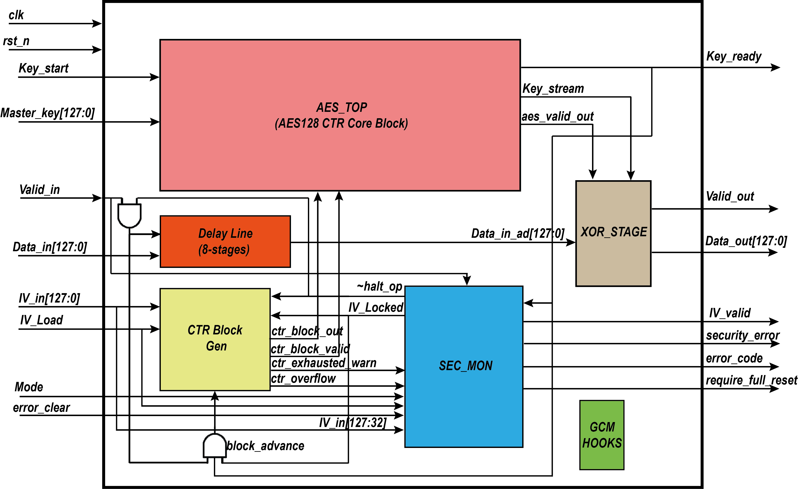

*Figure: Overall AES-CTR architecture exported directly from the project presentation.*

The architecture contains the **Counter Block Generator**, **AES Pipeline**, **Delay Line**, **XOR Unit**, and **Security Monitor**.

## Five-Stage Pipeline

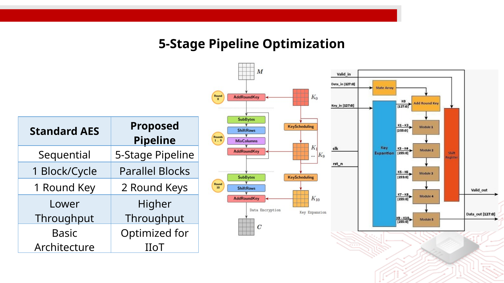

*Figure: Five-stage pipeline optimization from the project presentation.*

The reported architecture uses a five-stage pipeline and dual-round implementation. The CTR presentation reports an eight-cycle pipeline latency and one block per clock cycle.

## CTR Processing Flow

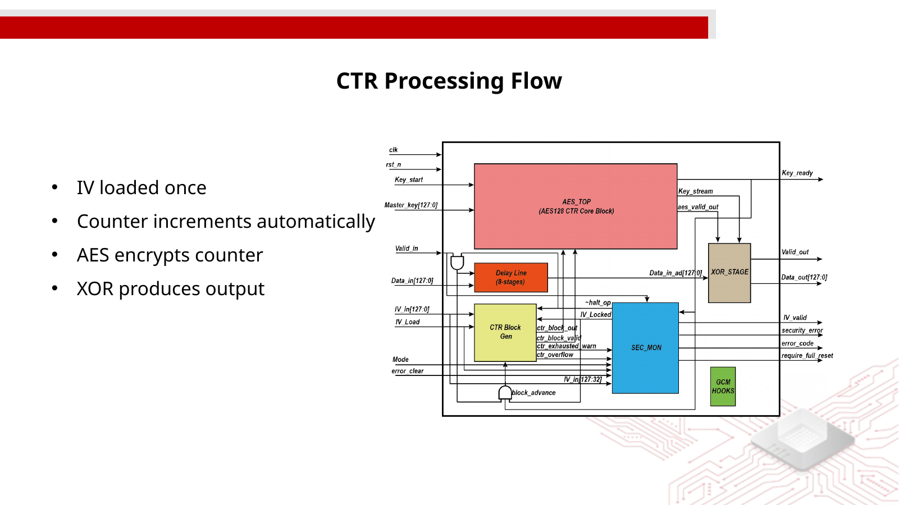

*Figure: CTR processing flow from the project presentation.*

The documented flow is:

1. IV is loaded once.
2. Counter increments automatically.
3. AES encrypts the counter.
4. The generated keystream is combined with the input through XOR.
5. The resulting data is produced at the output.

---

# Features

### Cryptographic

- AES-128 encryption core
- AES-128 CTR mode
- Stream-cipher-like behavior
- Same AES datapath for encryption and decryption
- Automatic counter increment
- NIST/FIPS test-vector verification

### High Throughput

- Five-stage pipeline
- Dual-round implementation
- One block every clock cycle
- Eight-cycle CTR pipeline latency
- Pre-calculated round keys
- LUT/GF S-Box selection

### Security Monitoring

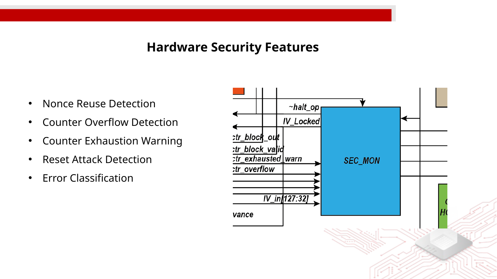

*Figure: Hardware security features documented in the presentation.*

- Nonce reuse detection
- Counter overflow detection
- Counter exhaustion warning
- Reset attack detection
- Error classification
- Warning and critical error handling

### FPGA

- AMD Kria KV260
- ARM + FPGA SoC
- AXI Lite control
- AXI Stream data
- DMA transfer
- FIFO buffering
- Endian conversion
- Linux/PetaLinux software control
- Custom Vivado IP

### Verification

- UVM verification environment
- Self-checking scoreboard
- Golden AES reference model
- NIST SP 800-38A vectors
- Constrained-random testing
- Security-oriented verification
- Error-recovery testing
- Constant pipeline-latency checking

### ASIC

- SkyWater 130 nm technology
- Open-source physical implementation flow
- Multi-corner timing analysis
- DRC
- LVS
- IR-drop analysis
- Final physical layout

---


# RTL Design

## AES Transformations

The AES datapath uses the standard AES transformations:

```text
SubBytes
   ↓
ShiftRows
   ↓
MixColumns
   ↓
AddRoundKey
```

| Transformation | Documented Implementation |
|---|---|
| SubBytes | Optimized S-Box |
| ShiftRows | Hard-wired byte permutation |
| MixColumns | GF(2⁸) matrix multiplication using XOR trees |
| AddRoundKey | Bitwise XOR |
| Key Expansion | Pre-calculated round keys |


## Key Expansion

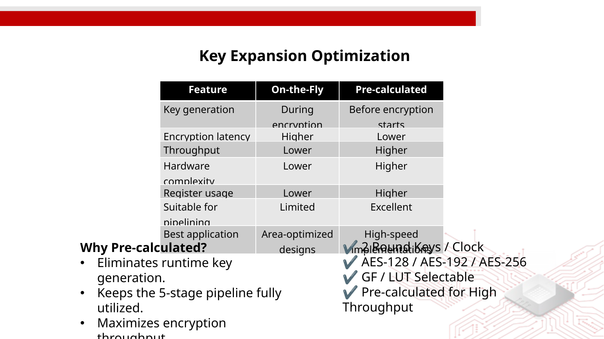

*Figure: Key-expansion optimization from the project presentation.*

The design uses pre-calculated round keys for high-throughput operation. The presentation documents support for AES-128/AES-192/AES-256 and two round keys per clock.

| Feature | On-the-Fly | Pre-calculated |
|---|---|---|
| Key generation | During encryption | Before encryption |
| Encryption latency | Higher | Lower |
| Throughput | Lower | Higher |
| Hardware complexity | Lower | Higher |
| Register usage | Lower | Higher |
| Pipeline suitability | Limited | Excellent |

## CTR Datapath

```text
          IV
          ↓
   Counter Generator
          ↓
      AES Pipeline
          ↓
      Keystream
          ↓
Data → XOR Unit → Output
```

The counter is generated independently from the data path and the keystream is aligned with the data through the documented delay-line mechanism.

---

# Verification & Simulation

## UVM Verification Architecture

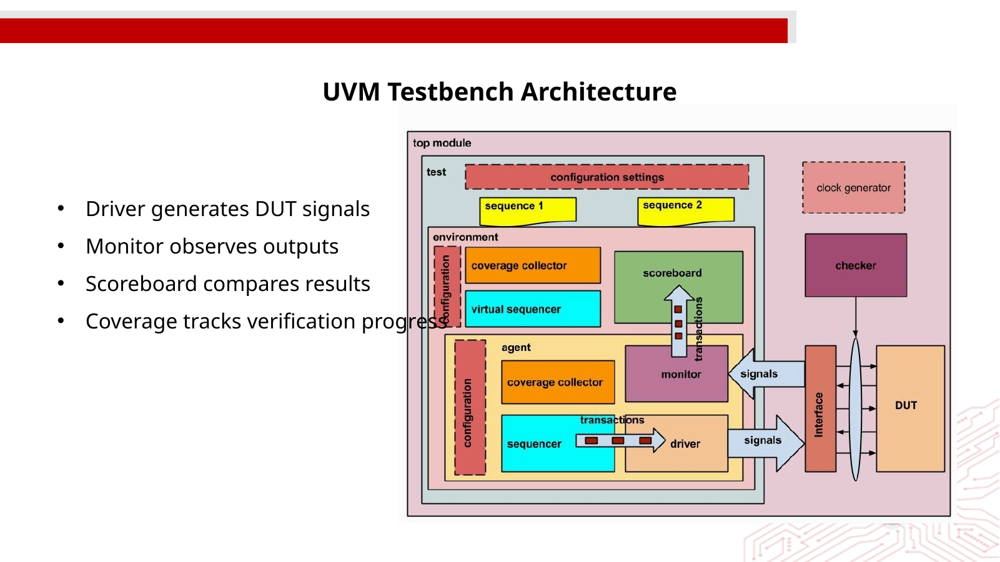

*Figure: UVM testbench architecture exported from the presentation.*

The environment includes a driver, monitor, scoreboard, and coverage components.

## Self-Checking Scoreboard

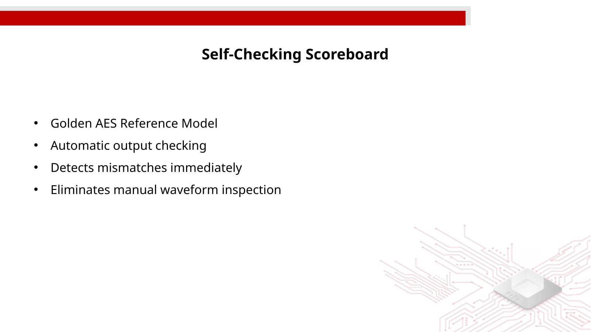

*Figure: Self-checking scoreboard and golden reference model.*

The scoreboard uses a golden AES reference model for automatic result comparison and immediate mismatch detection.

## Verification Strategy

The documented verification plan checks:

- NIST SP 800-38A F.5.1 encryption vectors.
- NIST SP 800-38A F.5.2 decryption vectors.
- Encryption/decryption round-trip correctness.
- Key loading and `keys_ready` timing.
- IV acceptance and session locking.
- Nonce-reuse error generation.
- Counter increment behavior.
- Counter exhaustion at `0xFFFFF000`.
- Counter overflow at `0xFFFFFFFF`.
- Constant eight-cycle pipeline latency.
- No output drops for back-to-back blocks.
- No leakage while inputs are blocked.
- Warning recovery through `error_clear`.
- Full reset recovery for critical errors.
- Keystream uniqueness.
- Key and IV avalanche behavior.
- Plaintext single-bit propagation.
- No X/Z values on critical outputs.
- Exact error-code classification.


---

# FPGA Implementation

## Target Platform

**AMD Kria KV260** — ARM + FPGA SoC platform.

The FPGA prototype is used to validate RTL on real hardware, identify timing/integration issues, verify data transfer and interfaces, enable hardware/software co-design, and reduce risk before ASIC implementation.

## FPGA System Architecture

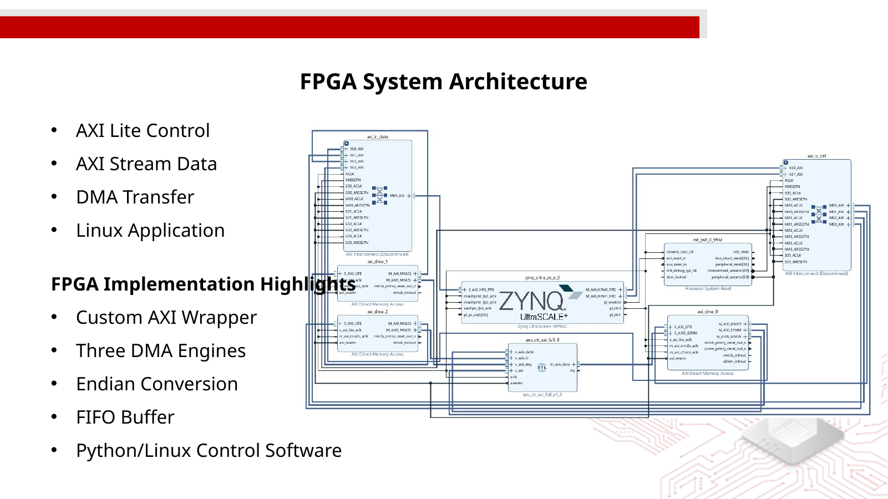

*Figure: FPGA system architecture from the project presentation.*

The documented system uses AXI Lite control, AXI Stream data, DMA transfer, and a Linux application. The implementation highlights include a custom AXI wrapper, three DMA engines, endian conversion, FIFO buffering, and Python/Linux control software.

## FPGA Resource Utilization

| Resource | Utilized | Available | Utilization |
|---|---:|---:|---:|
| CLB LUTs | 13,546 | 117,120 | 11.57% |
| CLB Registers | 8,782 | 234,240 | 3.75% |
| Block RAM Tiles | 12 | 144 | 8.33% |
| DSP Slices | 0 | 1,248 | 0.00% |
| BUFGCE | 1 | 112 | 0.89% |

## FPGA Results

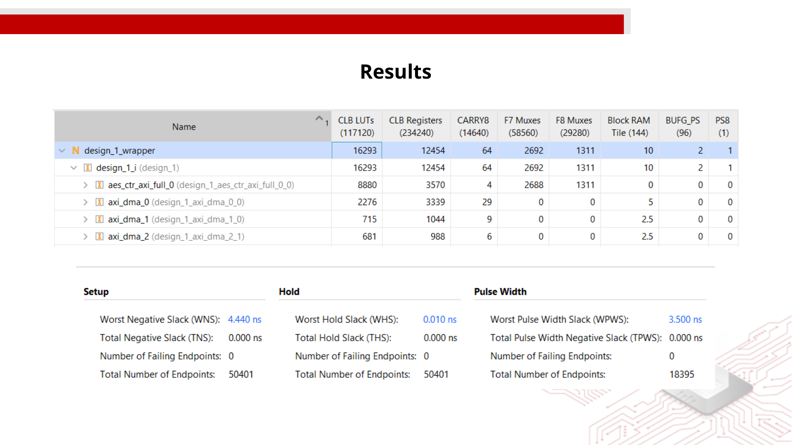

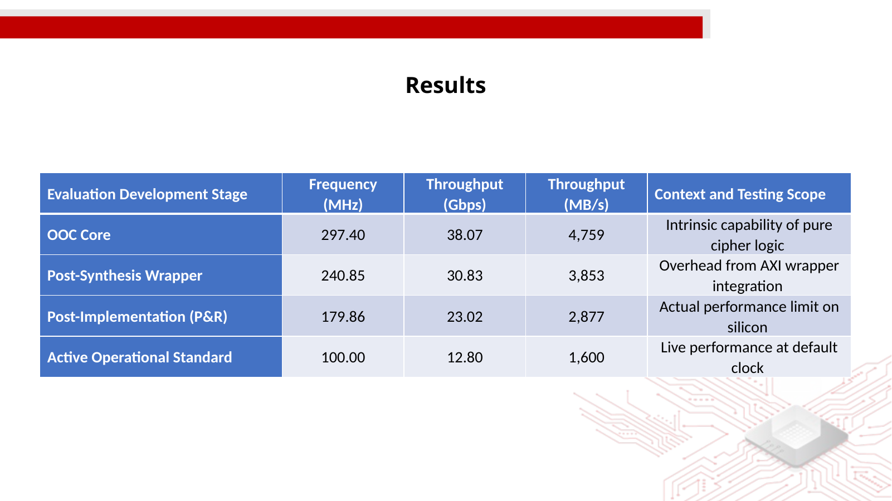

*Figures: FPGA results and timing/performance data from the presentation.*

### Post-Implementation Timing

| Parameter | Result |
|---|---:|
| Implemented frequency | 100 MHz |
| Clock period | 10.000 ns |
| WNS | +3.362 ns |
| WHS | +0.011 ns |
| TNS | 0 ns |
| Setup violations | 0 |
| Hold violations | 0 |
| Timing status | All constraints met |

### Reported Performance

| Development Stage | Frequency | Throughput | Throughput |
|---|---:|---:|---:|
| OOC Core | 297.40 MHz | 38.07 Gbps | 4,759 MB/s |
| Post-Synthesis Wrapper | 240.85 MHz | 30.83 Gbps | 3,853 MB/s |
| Post-Implementation P&R | 179.86 MHz | 23.02 Gbps | 2,877 MB/s |
| Active Operational Standard | 100.00 MHz | 12.80 Gbps | 1,600 MB/s |


# ASIC Implementation

## Technology

**SkyWater 130 nm (SKY130)**

## ASIC Design Flow

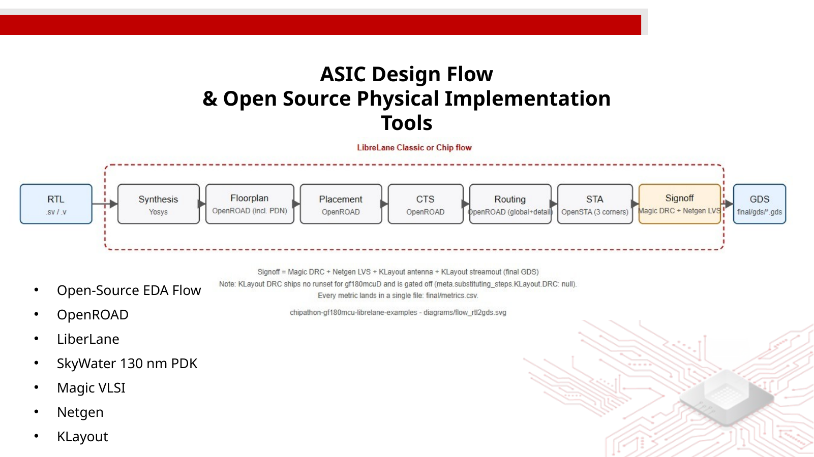

*Figure: Open-source ASIC physical implementation flow from the presentation.*

The documented flow uses:

- OpenROAD
- LiberLane
- SkyWater 130 nm PDK
- Magic VLSI
- Netgen
- KLayout

## ASIC Results

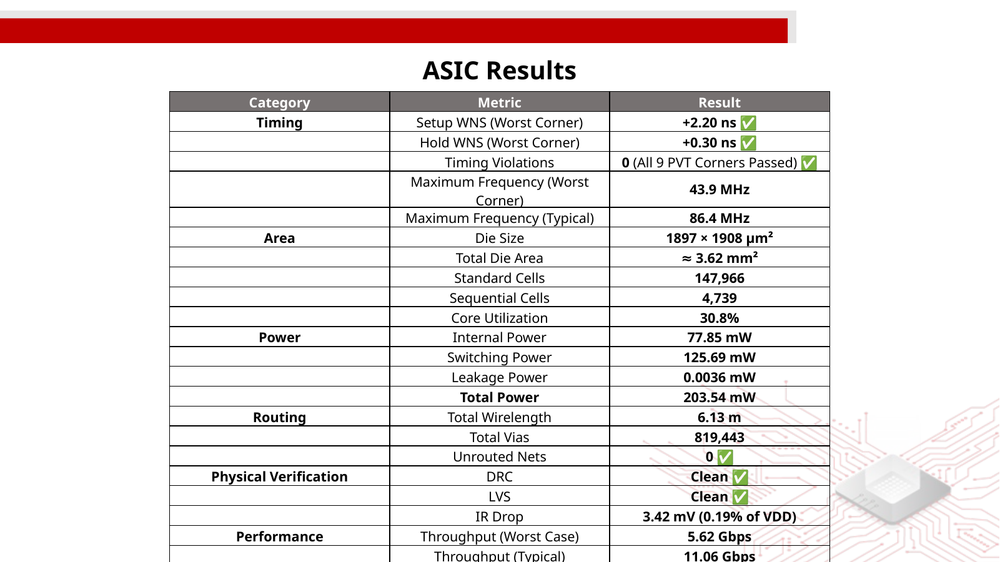

*Figure: ASIC timing, area, power, routing, and physical-verification results from the presentation.*

### Timing

| Metric | Result |
|---|---:|
| Setup WNS — worst corner | +2.20 ns |
| Hold WNS — worst corner | +0.30 ns |
| Timing violations | 0 |
| PVT corners passed | 9 |
| Maximum frequency — worst corner | 43.9 MHz |
| Maximum frequency — typical | 86.4 MHz |

### Area

| Metric | Result |
|---|---:|
| Die size | 1897 × 1908 µm² |
| Total die area | ≈ 3.62 mm² |
| Standard cells | 147,966 |
| Sequential cells | 4,739 |
| Core utilization | 30.8% |

### Power

| Metric | Result |
|---|---:|
| Internal power | 77.85 mW |
| Switching power | 125.69 mW |
| Leakage power | 0.0036 mW |
| **Total power** | **203.54 mW** |

### Routing & Physical Verification

| Metric | Result |
|---|---:|
| Total wirelength | 6.13 m |
| Total vias | 819,443 |
| Unrouted nets | 0 |
| DRC | Clean |
| LVS | Clean |
| IR drop | 3.42 mV (0.19% of VDD) |

### ASIC Throughput

| Condition | Throughput |
|---|---:|
| Worst case | 5.62 Gbps |
| Typical | 11.06 Gbps |

## Final Layout

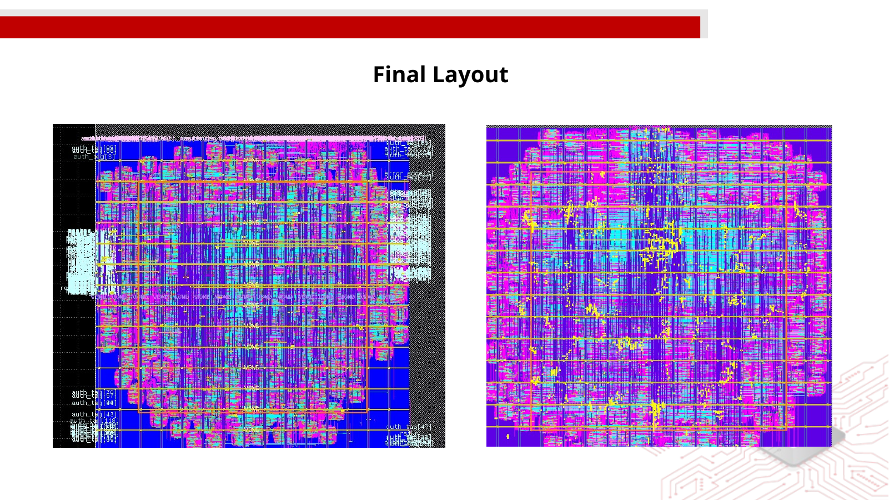

*Figure: Final ASIC physical layout from the presentation.*

## Final Layout 3D Model

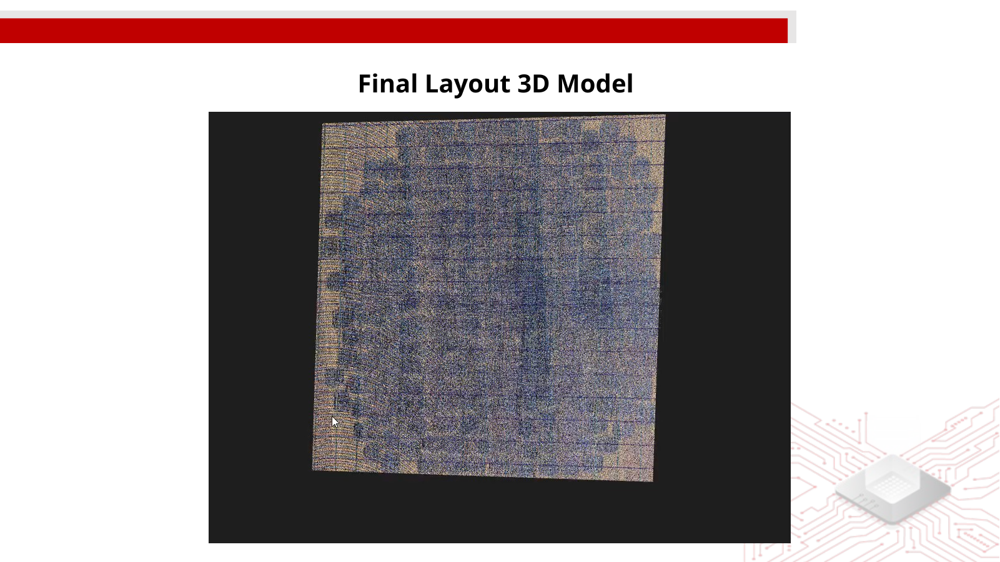

*Figure: Final ASIC layout 3D model from the presentation.*

---

# Tools Used

| Tool / Technology | Role |
|---|---|
| Verilog RTL | Hardware description |
| UVM | Functional verification |
| AMD Vivado | FPGA synthesis, implementation and IP integration |
| AMD Kria KV260 | FPGA/SoC prototype |
| PetaLinux | Linux FPGA environment |
| AXI | Hardware/software communication |
| DMA | High-speed data transfer |
| OpenROAD | ASIC physical implementation |
| LiberLane | ASIC flow |
| SkyWater 130 nm PDK | ASIC technology |
| Magic VLSI | Physical verification/layout |
| Netgen | LVS |
| KLayout | Layout inspection/verification |

---

# How To Run

> The presentation specifies the design flow and tools but does not provide the exact repository filenames, Makefiles, Tcl scripts, or simulator command lines. Therefore, the commands below describe the intended flow without inventing project-specific scripts.

## Simulation

```bash
# Compile RTL and UVM sources using the simulator configured for the project
<simulator> -compile <rtl_sources> <uvm_sources>

# Run a selected UVM test
<simulator> -run <test_name>
```

Verify NIST vectors, round-trip behavior, counter operation, security errors, and eight-cycle pipeline latency.

## FPGA Implementation

```text
RTL
 ↓
Vivado Project
 ↓
Synthesis
 ↓
Implementation
 ↓
Timing Analysis
 ↓
Bitstream
 ↓
Kria KV260
 ↓
Linux/PetaLinux Application
```

Example entry point:

```bash
vivado
```

The exact Vivado project/Tcl commands depend on the repository implementation.

## ASIC Flow

```text
RTL
 ↓
Synthesis
 ↓
OpenROAD
 ↓
Floorplan
 ↓
Placement
 ↓
Clock Tree
 ↓
Routing
 ↓
Timing
 ↓
DRC / LVS / IR Drop
 ↓
Final Layout
```

The exact flow scripts and command-line arguments should be taken from the repository's ASIC implementation directory when those scripts are added.

---

# Results Summary

| Metric | FPGA / KV260 | ASIC / SKY130 |
|---|---:|---:|
| Technology | AMD Kria KV260 | SkyWater 130 nm |
| Main operating frequency | 100 MHz | 43.9 MHz worst case |
| Maximum reported frequency | 297.40 MHz OOC | 86.4 MHz typical |
| Throughput | 12.80 Gbps @ 100 MHz | 5.62 Gbps worst case |
| Typical throughput | — | 11.06 Gbps |
| Pipeline | 5 stages | 5-stage architecture |
| CTR latency | 8 cycles | — |
| ASIC total power | — | 203.54 mW |
| ASIC area | — | ≈ 3.62 mm² |
| FPGA LUTs | 13,546 | — |
| FPGA registers | 8,782 | — |
| FPGA BRAM | 12 tiles | — |
| FPGA DSP | 0 | — |
| ASIC sequential cells | — | 4,739 |
| Timing violations | 0 | 0 |
| ASIC DRC | — | Clean |
| ASIC LVS | — | Clean |
| ASIC unrouted nets | — | 0 |

> **Power note:** The 1.00 W figure in the presentation belongs to the standalone LUT-based S-Box comparison, not the complete FPGA hardware/software co-design. The ASIC total power is reported separately as 203.54 mW.

---

# References

1. National Institute of Standards and Technology (NIST), **Advanced Encryption Standard (AES), FIPS 197**.
2. National Institute of Standards and Technology (NIST), **Recommendation for Block Cipher Modes of Operation: Methods and Techniques, SP 800-38A**.
3. SkyWater Technology, **SkyWater 130 nm Process Design Kit (SKY130)**.
4. AMD, **Kria KV260 Vision AI Starter Kit**.
5. Universal Verification Methodology (UVM).

